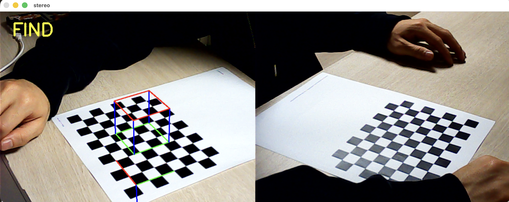

# ANTI DJ DJ CLUB

> "No decks, no problem."

웹캠 두 대와 MediaPipe를 활용해 손의 3D 절대좌표를 추적하고, 허공에 가상 디제잉 머신을 띄워 실제 장비 없이 제스처만으로 디제잉을 구현하는 프로젝트.

---

## 프로젝트 소개

턴테이블도, 믹서도, CDJ도 없다. 그런데 디제잉은 하고 싶다. ANTI DJ DJ CLUB은 카메라와 컴퓨터 비전 기술만으로 가상 디제잉 환경을 만든다. 손의 움직임만으로 트랙을 재생하고, 스크래치하고, 믹싱할 수 있다.

---

## 핵심 기술

- **두 개의 카메라**: 두 대의 웹캠으로 손의 위치를 서로 다른 시점에서 촬영
- **MediaPipe Hands**: 각 카메라에서 손의 랜드마크(2D 좌표) 검출
- **삼각측량**: 두 시점의 2D 좌표를 결합해 손의 3D 절대좌표 복원
- **PnP**: 고정된 월드 좌표계에 가상 디제잉 머신을 정확한 위치에 렌더링
- **제스처 기반 제어**: 손의 위치와 움직임만으로 디제잉 인터페이스 조작

---

## 동작 흐름

```
카메라 0, 1  →  손 감지 (MediaPipe)  →  3D 삼각측량  →  손가락 3D 좌표
                                                               ↓
                                          제스처 분류 (컨트롤 구역 매핑)
                                                               ↓
                                    재생 / 루프 / 큐 / 스크래치 이벤트
                                                               ↓
                              오디오 엔진 (pygame + sounddevice)
                                                               ↓
                          시각화 출력 (파형 + 탑뷰 + AR 부스 오버레이)
```

---

## 실행 결과

### 캘리브레이션 (`cali.py`)


체스보드 패턴을 인식해 두 카메라의 내부 파라미터(초점 거리, 왜곡 계수 등)를 계산하고 `cali_result.txt`로 저장한다.

---

### 포즈 추정 (`pose.py`)



캘리브레이션된 카메라 파라미터를 바탕으로 체스보드에 대한 두 카메라의 외부 파라미터(위치·방향)를 계산하고 `pose.txt`로 저장한다.

---

### 메인 실행 (`main.py`)


두 카메라 피드 위에 AR 부스 오버레이가 합성되고, 실시간 비트 싱크 파형과 탑뷰 DJ 인터페이스가 함께 표시된다.

---

## 프로젝트 구조

```
virtual_dj_machine/
├── main.py                # 메인 애플리케이션 (제스처 인식 + 오디오 엔진 + 시각화)
├── dj_model.py            # 독립 실행형 3D DJ 컨트롤러 뷰어
├── pose.py                # 카메라 포즈 추정
├── cali.py                # 카메라 내부 파라미터 캘리브레이션
├── hand_landmarker.task   # MediaPipe 손 랜드마크 모델
├── pose.txt               # 저장된 카메라 포즈 데이터
├── cali_result.txt        # 카메라 캘리브레이션 결과
├── images/                # 결과 스크린샷
└── sound/
    ├── left/              # 왼쪽 덱 트랙 (.mp3)
    └── right/             # 오른쪽 덱 트랙 (.mp3)
```

---

## 요구 사항

### 소프트웨어

```bash
pip install opencv-python mediapipe numpy librosa pygame sounddevice
```

| 라이브러리 | 용도 |
|---|---|
| OpenCV | 카메라 입력, 이미지 처리, 시각화 |
| MediaPipe | 손 랜드마크 감지 |
| NumPy | 수치 연산 및 3D 삼각측량 |
| librosa | BPM 감지, 비트 추적, 진폭 분석 |
| pygame | 오디오 재생 (듀얼 채널 믹서) |
| sounddevice | 스크래치용 저지연 오디오 스트리밍 |

### 하드웨어

- **카메라 2대** (인덱스 0, 1) — 손 추적용 스테레오 카메라
- **카메라 1대** (인덱스 2, 선택사항) — DJ 부스 전체 뷰
- **체스보드 패턴** — 10×7 칸, 정사각형 한 변 2.0cm (최초 캘리브레이션 시 필요)
- **오디오 출력 장치**

---

## 설치 및 실행

### 1. 최초 캘리브레이션 (처음 한 번만)

```bash
# 카메라 내부 파라미터 캘리브레이션
python3 cali.py
# → cali_result.txt 생성

# 카메라 포즈 추정 (두 카메라에서 체스보드가 보여야 함)
python3 pose.py
# → pose.txt 생성
```

### 2. 메인 애플리케이션 실행

```bash
python3 main.py
```

---

## 조작 방법

| 동작 | 기능 |
|---|---|
| 바이닐 위에서 Y축 이동 | 스크래치 (위/아래 → 빠름/느림) |
| PLAY 버튼 탭 | 재생/정지 토글
| LOOP 버튼 탭 | 루프 온/오프 토글 |
| CUE 버튼 탭 | 현재 위치에 큐 포인트 설정 |

> 손가락 끝의 Z좌표가 임계값(−1.0) 이하로 들어오면 탭 동작으로 인식합니다.
